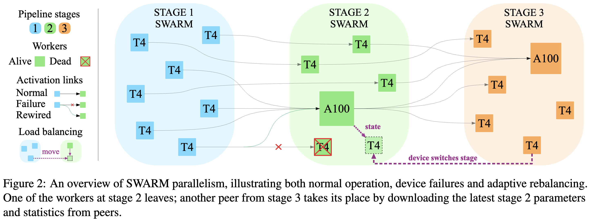

# SWARM Parallelism: Training Large Models Can Be Surprisingly Communication-Efficient



This repository contains the code to replicate experiments of
["SWARM Parallelism: Training Large Models Can Be Surprisingly Communication-Efficient"](https://arxiv.org/abs/2301.11913).

**Note:** this codebase, as well as the project itself, is a work in progress: 
certain features (e.g., rebalancing between pipeline stages) are not yet added to the repository, expect the paper to get updated as well.
In the meantime, you can watch this repository or visit the [repository](https://github.com/bigscience-workshop/petals)
of [Petals](https://petals.ml/) — a similar project for *inference* of large language models that was inspired by SWARM
and shares portions of codebase with it.

# Large-scale experiments and throughput estimation

Instructions to replicate the experiments on large-scale language model pretraining and throughput estimation on
multiple preemptible nodes, as well as the prototype implementation of SWARM, are located in
the [swarm](./swarm) subfolder.

# Bottleneck experiments

Instructions to replicate the compression-aware architecture experiments can be found
in [bottleneck/README.md](bottleneck/README.md).

# Contacts

Feel free to ask any questions about this work [by email](mailto:mryabinin0@gmail.com).

# References

```
@misc{ryabinin2023swarm,
    title={SWARM Parallelism: Training Large Models Can Be Surprisingly Communication-Efficient},
    author={Max Ryabinin and Tim Dettmers and Michael Diskin and Alexander Borzunov},
    year={2023},
    eprint={2301.11913},
    archivePrefix={arXiv},
    primaryClass={cs.DC}
}
```